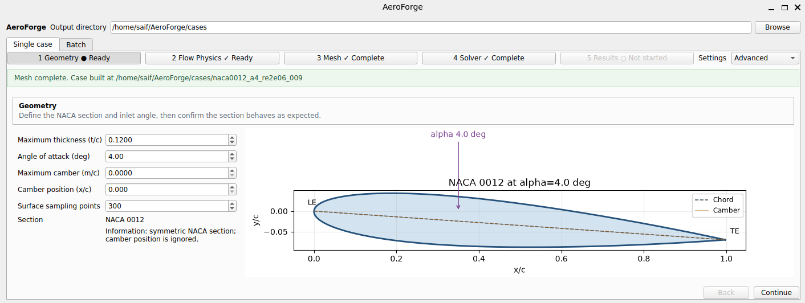
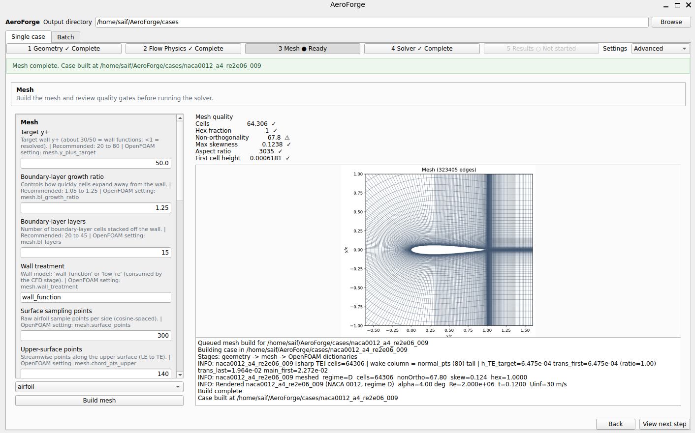
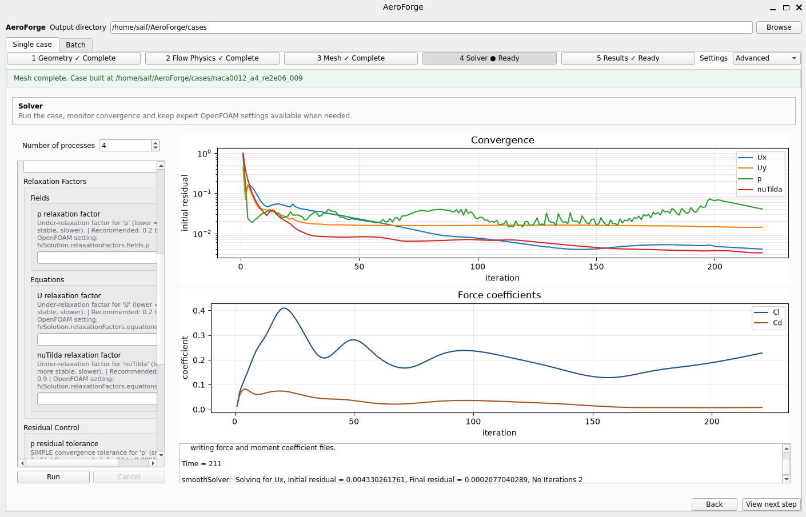
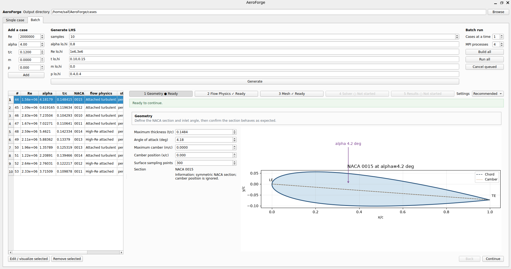

## Objective

AeroForge was built to preserve consistent geometry construction, meshing decisions, boundary conditions, convergence checks, and force extraction across aerodynamic parameter studies.

AeroForge is scientific infrastructure for controlled aerodynamic experimentation. The PyQt desktop interface is an implementation mechanism; the central contribution is the reproducible pipeline behind it:

`parameterized geometry → controlled meshing → quality and near-wall checks → solver execution → convergence monitoring → force extraction → repeatable CFD campaign`

## Parameterized geometry and controlled meshing

NACA four-digit geometry is generated from thickness, camber, camber position, angle of attack, and surface resolution. Gmsh then constructs the solver mesh under common meshing rules. Cell count, non-orthogonality, skewness, aspect ratio, first-cell height, layer count, and growth are exposed as evidence about the numerical model rather than hidden behind a “mesh complete” status.

## Solver consistency and convergence evidence

OpenFOAM case templates standardize boundary conditions and numerical settings while retaining expert controls. Residual and force histories are monitored during execution, and lift and drag are extracted in a consistent form for downstream comparison. This makes failed, unconverged, and numerically inconsistent cases easier to identify before their outputs contaminate a study.

## From one case to a reproducible campaign

Cases can be specified directly or sampled using Latin Hypercube Sampling across Reynolds number, angle of attack, thickness, and camber variables. Controlled parallel execution applies the same preprocessing, solver, and post-processing sequence to each design.

Automation matters scientifically because it reduces unintended differences between cases, records the assumptions used to create them, standardizes acceptance checks, and makes large simulation datasets repeatable. AeroForge does not make an OpenFOAM result valid by itself; it makes the steps needed to assess and reproduce that result more consistent.

## Limitations

The current pipeline is centered on NACA four-digit sections and the implemented OpenFOAM templates. Mesh and convergence checks are necessary but not sufficient for physical validation, which still requires appropriate benchmark data and model-form assessment for each flow regime.
