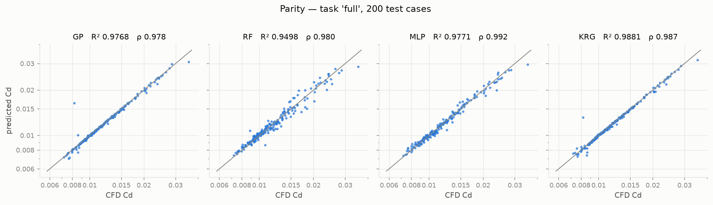
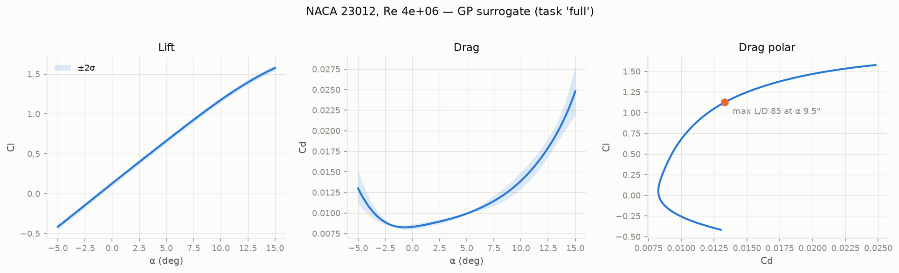

## Research question

How accurately can aerofoil force coefficients be predicted from a handful of geometric and operating parameters, and how does that compare with learning the whole flow field first?

A steady RANS solution of an aerofoil takes on the order of 25 minutes. A surrogate answers in milliseconds, but that speed is only useful if the model is tested honestly, compared against a meaningful baseline, and open about where it stops being reliable.

```text
(angle of attack, Reynolds number, NACA section) → (Cl, Cd, L/D)
```

## Training evidence: AirfRANS

CamberLab is trained on **AirfRANS** (Bonnet et al., NeurIPS 2022): 1,000 steady 2D incompressible RANS simulations in OpenFOAM with the k-ω SST model, covering NACA 4- and 5-digit sections at Re 2–6 × 10⁶ and α −5° to 15°. The CFD itself belongs to the AirfRANS authors; CamberLab's work starts from their stored solutions.

Each sample is reduced to one row. The aerofoil wall is recovered from the unlabelled CFD mesh as the boundary loop off the outer domain, and summarised by four section features: maximum thickness and its location, and maximum camber and its location. At query time the same feature extractor is applied to an analytically generated NACA section, so training and prediction see identical geometry features.

Before any model is fitted, the data passes a quality gate: hard physical checks (none of the 1,000 rows fail), lift-slope and zero-lift-angle sanity checks, leave-one-out outlier screening (ten rows flagged, all kept because they are physically plausible separation cases), and a comparison of near-NACA 0012 cases against Ladson's experiment and NASA TMR CFL3D SST results.

`AirfRANS RANS solutions → mesh-wall geometry recovery → QA gate → official splits → surrogate comparison`

## Comparing surrogate models

Gaussian Process, Kriging (SMT), multilayer perceptron and Random Forest models each learn Cl and log Cd from six standardised inputs. Train/test memberships are the official AirfRANS task splits, frozen in the repository; test rows are used once, for evaluation only, and model hyperparameters are chosen by cross-validation on the training rows.



On the `full` task (800 training, 200 test cases), the best models reach Cl R² ≈ 0.999 and Cd R² 0.977–0.988, with median relative errors around 1% for lift and 0.5–0.7% for drag.

## Benchmarking against field-prediction models

The AirfRANS paper's baselines predict the full velocity and pressure field and integrate forces from it. Because CamberLab uses the same test sets and the paper's own metrics, the two approaches can be compared directly across all four tasks (`full`, `scarce`, `reynolds`, `aoa`), using the authors' corrected results:

| Task | Best drag ranking ρ_D (CamberLab) | Best ρ_D (paper) | Best mean rel. Cd error (CamberLab) | Best (paper) |
|---|---|---|---|---|
| `full` | 0.992 | 0.250 | 1.5% | 618% |
| `scarce` | 0.990 | 0.254 | 3.2% | 454% |
| `reynolds` | 0.962 | 0.192 | 6.2% | 829% |
| `aoa` | 0.964 | 0.552 | 2.1% | 435% |

The result is not that one approach is better in general: field models produce the whole flow, while CamberLab produces only coefficients. It shows that when the quantity of interest is integrated force, regressing it directly is far more accurate, especially for drag.

## Showing where prediction can be trusted



Gaussian Process and Kriging models provide posterior uncertainty; on held-out `full` test cases the GP ±2σ bands contain 95–97% of the CFD values, close to the nominal rate, and become slightly overconfident under extrapolation. Queries outside the training envelope still return a prediction, but always with an explicit warning. The interactive demo presents lift, drag, drag-polar and L/D sweeps for any NACA 4- or 5-digit section together with these bands.

## Validation and limitations

- **Envelope:** Re 2–6 × 10⁶, α −5° to 15°, NACA 4- and 5-digit sections only. Outside it, results are extrapolations.
- **Physics of the data:** the underlying CFD is fully turbulent steady RANS without transition modelling, so drag is biased high against tripped or free-transition experiments at the lower Reynolds numbers, and near-stall predictions inherit the weaknesses of steady RANS. The surrogate cannot be more accurate than the CFD it learns from.
- **Known weak spot:** when trained on Re 3–5 × 10⁶ and asked about lower Re, the GP and Kriging drag models overpredict drag by up to about 5× for a few thin cambered sections at negative α. Random Forest and MLP extrapolate drag more gracefully there.
- **Single fits:** reported numbers are one deterministic fit per model, whereas the paper averages five trained copies.

## History of the project

CamberLab originally generated its own OpenFOAM dataset with a four-regime design, using separate turbulence models, meshes and reference validation for attached, near-stall, transitional low-Re and high-Re flow. That campaign produced too few, and too unevenly converged, cases to support a reliable surrogate, so it was retired and archived in the repository; the case-generation tooling continues in [AeroForge](/projects/aeroforge/). Moving to a large public benchmark dataset also made the like-for-like comparison above possible.

## Possible extensions

Physics-informed structure for the drag model (for example a skin-friction baseline so drag cannot fall as Re decreases), shape-based inputs from the stored surface coordinates, Cp(x) prediction from the pressure fields, active learning and multi-fidelity data are natural next steps. These are not presented as completed features.

`benchmark CFD dataset → surrogate comparison → like-for-like benchmark → uncertainty-aware accelerated prediction`

*Training data: AirfRANS, © Safran, Open Database License (ODbL 1.0). F. Bonnet, A. J. Mazari, P. Cinnella, P. Gallinari, "AirfRANS: High Fidelity Computational Fluid Dynamics Dataset for Approximating Reynolds-Averaged Navier–Stokes Solutions", NeurIPS Datasets and Benchmarks Track, 2022.*
