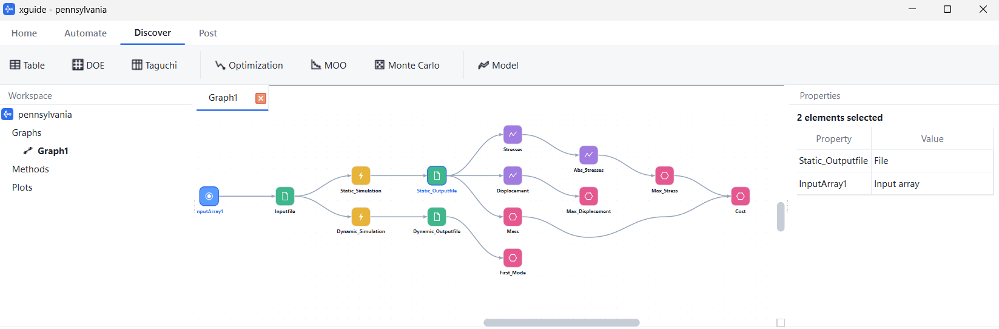
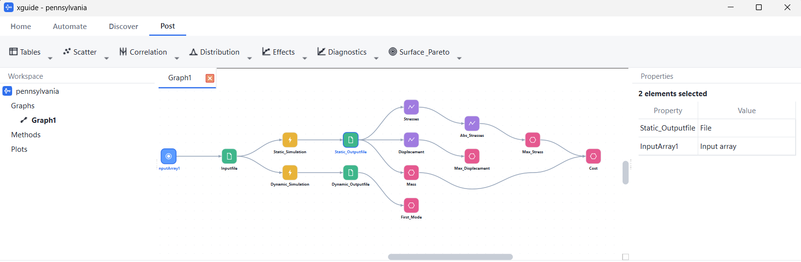

## Objective

XGuide was developed so that the same traceable simulation process could support controlled parameter studies, optimization, and uncertainty propagation without rebuilding the experiment for every method.

XGuide is infrastructure for **computational experimentation**. It represents simulation inputs, model preparation, solver execution, response extraction, and objective or constraint calculation as a reusable process. The visual interface helps inspect that process, but the research value lies in applying consistent computations across many designs.

## A reusable simulation process

Design candidates enter a process that prepares solver models, executes static or dynamic analyses, and extracts quantities such as stress, displacement, mass, and modal response. Reduction nodes convert raw fields into scalar responses used as objectives, constraints, or uncertainty outputs.

`sampled inputs → solver-ready models → simulations → verified responses → scientific interpretation`

Because the process is modular, the same structure can represent CFD, thermal, structural, fatigue, acoustic, or custom Python calculations. The important requirement is that each plugin preserves the inputs, outputs, units, and failure state needed to interpret the experiment.

## Methods of computational experimentation

### Design of Experiments and Taguchi studies

DOE and parameter sweeps sample combinations of design variables so their effects and interactions can be studied with fewer solver evaluations than an unstructured search. Taguchi designs provide a structured route to factor-level and noise-sensitivity studies.

### Optimization and Pareto analysis

For optimization, a candidate is evaluated through the same simulation process and its responses return to the search method. Multi-objective studies retain conflicting responses and identify non-dominated designs, allowing the result to be interpreted as a Pareto set rather than collapsed prematurely into one score.

### Monte Carlo uncertainty propagation

Monte Carlo sampling propagates uncertain material, geometry, load, or boundary-condition inputs through the simulation. Output distributions can then expose variability and estimated requirement-violation probability rather than reporting only a nominal design.

## Research relevance and limits

The platform supports simulation-driven design, robust design, uncertainty quantification, and surrogate-assisted optimization by making the underlying computational experiment reusable. It does not guarantee that a sampling plan is sufficient, an optimizer has found a global optimum, or a Monte Carlo estimate has converged; those remain study-specific numerical questions requiring diagnostics and evidence.
