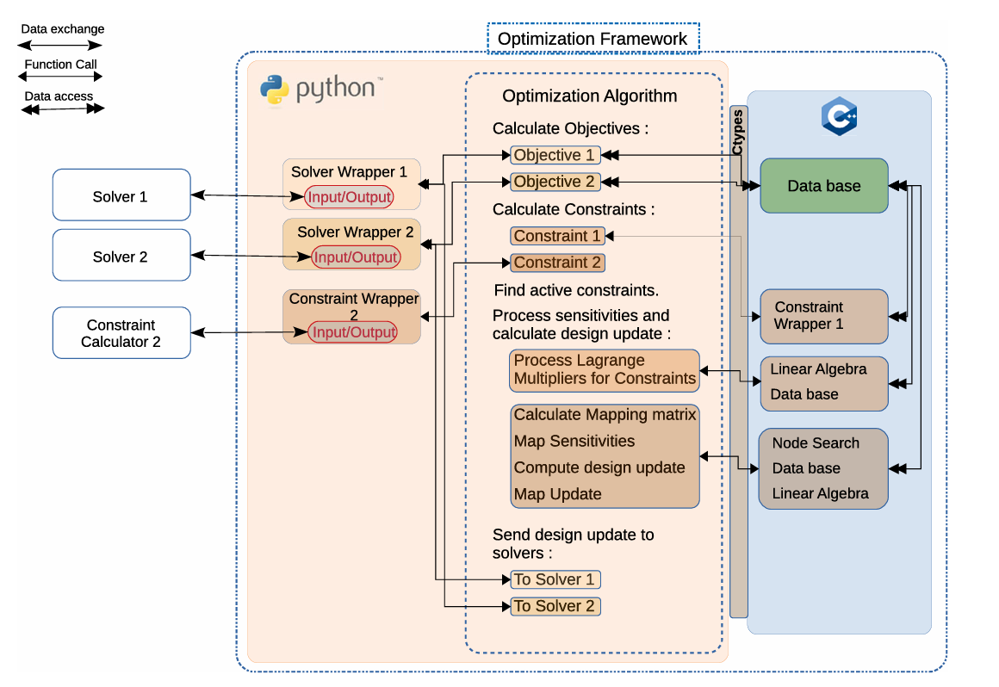

This page describes transferable numerical and computational work. Project identifiers, customers, internal links, implementation details, and proprietary data are intentionally omitted.

## Why shape optimization is numerically difficult

Shape optimization is not a single solver call. It is a coupled iterative process:

`simulation → response → sensitivity → parameterisation → geometry update → mesh motion → repeated solve → convergence`

Each stage introduces a different numerical question. The response must be defined consistently; its sensitivity must correspond to the same formulation; raw nodal information must be mapped into admissible shape changes; geometry and volume meshes must remain usable; and the repeated process must converge without violating constraints.

For a PDE-constrained problem, the design can be written schematically as

$$\min_{\mathbf{s}}\; J\big(\mathbf{X}_{\Gamma}(\mathbf{s}),\mathbf{Q}(\mathbf{X}_{\Gamma})\big)$$

$$\text{subject to}\quad \mathbf{r}\big(\mathbf{X}_{\Gamma}(\mathbf{s}),\mathbf{Q}(\mathbf{X}_{\Gamma})\big)=0,$$

where $\mathbf{s}$ denotes design variables, $\mathbf{X}_{\Gamma}$ the surface geometry, $\mathbf{Q}$ the state variables, and $\mathbf{r}$ the discretized governing equations.

## My role

I made substantial, core contributions to a large node-based adjoint-driven shape-optimization framework during approximately **770 hours of industrial development and investigation**. The framework connected multiple structural and CFD solvers for multi-objective, multi-constraint studies. My contribution covered numerical-method implementation and verification, solver orchestration, response and sensitivity handling, geometry processing, and reproducible execution. It was collaborative work; I do not claim sole ownership of the full framework.

## Numerical methods investigated

### Responses and sensitivities

I worked with response values and surface sensitivities produced by direct and adjoint formulations. A central task was to determine what a sensitivity represented before comparing, mapping, or using it. Two fields can have similar names while differing in normalization, sign convention, coordinate basis, discretization, or mathematical definition.

Adjoint gradients are particularly valuable when a problem has many shape variables and comparatively few responses: the cost of sensitivity evaluation can be made less dependent on the number of design variables. That computational advantage does not remove the need to verify that the implemented derivative corresponds to the stated response.

### Parameterisation, vertex morphing, and mesh motion

Node-level sensitivities cannot be applied as arbitrary independent displacements without damaging surface quality. The framework used geometry parameterisation and **vertex morphing** to filter and map sensitivity information into smooth surface updates while respecting fixed regions and geometric constraints. Mesh-motion and solver-update steps then propagated admissible boundary changes to the computational model.

### Multi-solver optimization

The work connected Python orchestration with performance-critical C++ components and solver interfaces for Abaqus, OptiStruct, KratosMultiphysics, and STAR-CCM+. The computational problem was not simply “supporting several file formats”; it was preserving consistent response definitions, units, coordinate conventions, convergence checks, and update semantics across fluid and structural formulations.

## Numerical verification

Verification was a prominent part of the work because small implementation differences can be either harmless floating-point variation or evidence of a changed numerical method.

- **Surface normals.** I investigated node-normal computation and the consequences of area-weighted versus angle-weighted aggregation. On irregular surface meshes, that choice changes the direction used to project sensitivities and shape updates.
- **Relative versus absolute differences.** A small absolute residual can be significant when the expected quantity is near zero, while a larger absolute difference may be negligible at the scale of the response. Comparisons therefore required context-specific measures rather than a single universal threshold.
- **Experimentally derived tolerances.** Test tolerances were established from repeated solver and platform behaviour, sensitivity scale, and the numerical consequence of a difference, instead of being selected only to make a regression test pass.
- **Cross-platform reproducibility.** Floating-point ordering, math libraries, parallel reductions, and platform differences can perturb iterative calculations. I examined whether observed changes were consistent with those effects or altered the optimization result materially.
- **Solver-version comparison.** Version changes were checked at the response, sensitivity, and downstream-update levels. Matching a scalar response alone is insufficient if the surface gradient has changed.
- **Mathematical comparability.** In several investigations, the correct conclusion was that two sensitivity outputs should not be compared directly because their formulations or normalizations differed. Establishing non-comparability is itself a verification result.

## Research relevance

This experience connects directly to **PDE-constrained optimization**, aerodynamic and structural shape optimization, design sensitivities, multidisciplinary optimization, and simulation-driven design. More broadly, it developed habits central to computational research: state the mathematical quantity being compared, isolate numerical and implementation sources of difference, build tolerances from evidence, and preserve a reproducible path from solver output to scientific conclusion.

## Limits of this account

The public page cannot provide proprietary geometries, solver cases, convergence histories, or internal validation datasets. It therefore documents the numerical questions and transferable methods without presenting confidential industrial outcomes as open research results.
