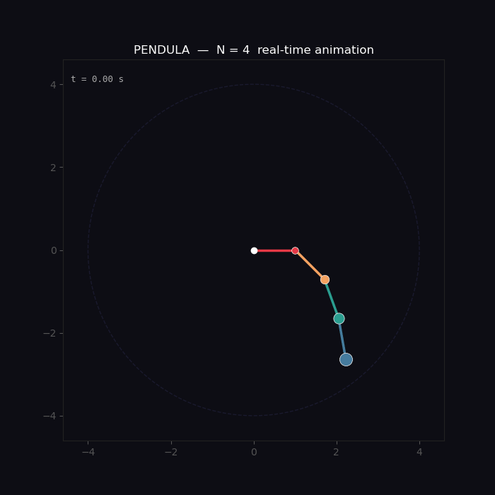
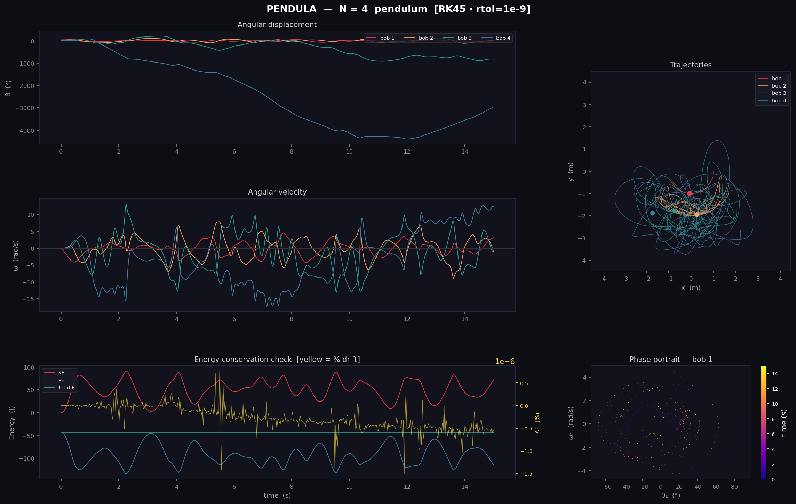

A double pendulum is a familiar demonstration of chaos. Adding a third or fourth link, however, usually creates a less elegant problem: the equations grow, the couplings multiply, and a derivation written for one chain length must be rebuilt for the next.

I built Pendula around a different question: **could one formulation simulate any number of connected pendulums without deriving every case by hand?**

## From Simple Rules to Chaotic Motion

The animation is the immediate result. Rigid, massless rods connect point masses in a vertical plane, and each angle is measured from the downward vertical. The user chooses the number of links, individual lengths and masses, initial angles and angular velocities, gravity, simulation time, frame rate, and trail length.

Once released, the links exchange energy through their coupled motion. For multi-link systems, tiny differences in the initial state can grow into visibly different trajectories. The motion may look unpredictable, but it remains deterministic: the same inputs always produce the same numerical path.

## One Equation for N Links

Behind the animation, Lagrangian mechanics turns the system into a configuration-dependent mass matrix:

`M(θ) α = f(θ, ω)`

At every timestep, Pendula assembles the matrix and forcing vector, solves for all angular accelerations with NumPy, and passes the resulting first-order system to SciPy’s `solve_ivp`. RK45 handles smaller chains efficiently; Radau is selected for five or more links, where aligned rods can make the system increasingly stiff and the mass matrix poorly conditioned.

## Proving the Motion Is Numerically Credible

The static report explains what the GIF cannot. Angular displacement and velocity plots expose each link’s evolution. XY traces show where every bob travelled, while the phase portrait reveals how the first bob moves through state space.

Most importantly, kinetic and potential energy exchange while total mechanical energy remains nearly constant. Pendula plots percentage energy drift as a numerical quality check; with tight solver tolerances, the README reports drift below 0.01% for chains up to six links over a 20-second window.

The project therefore connects derivation, computation, and visual evidence in one reusable loop:

`Lagrangian model → Matrix solve → Adaptive integration → Chaos visualization → Energy check`
