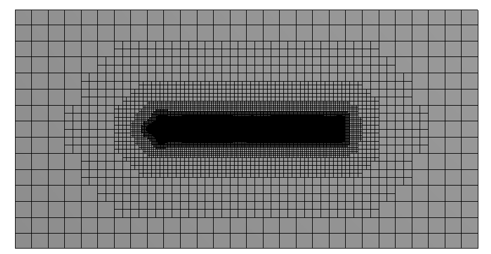
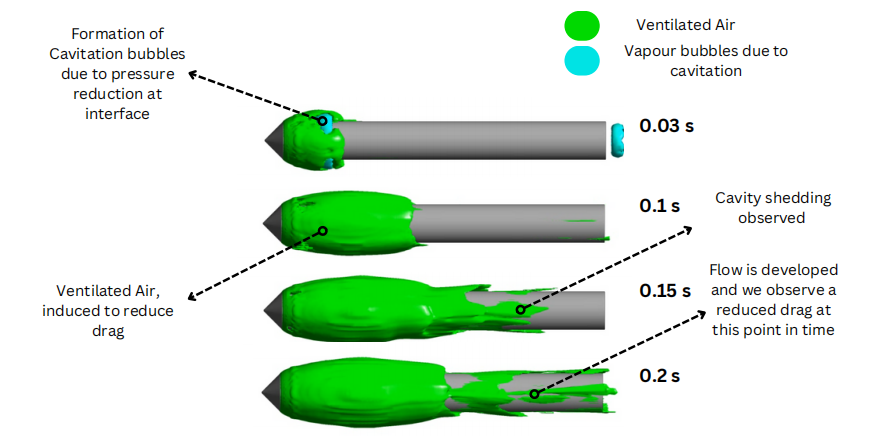
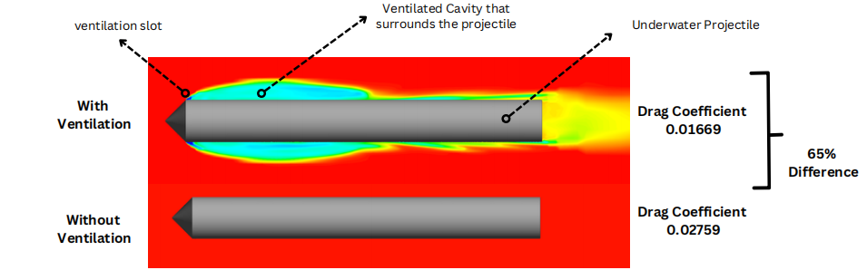

## Research question

What role does controlled gas ventilation play in cavity formation, stability, and hydrodynamic drag around underwater bodies, and can CFD-generated transient evidence support faster prediction of the resulting drag response?

## Physical problem

An underwater body normally transfers momentum to dense liquid over most of its wetted surface. Ventilated supercavitation introduces gas near the cavitator so that a gas-rich cavity envelops more of the body. The reduction in liquid contact can reduce drag, but the cavity is unsteady: its interface develops, oscillates, and sheds while interacting with the surrounding turbulent flow. A useful model must therefore represent both the evolving gas-liquid interface and its influence on pressure and force.

## Numerical methodology

I modelled the investigated disk- and cone-cavitator cases using **transient RANS with a Volume-of-Fluid multiphase formulation**. The calculations followed cavity development under controlled ventilation conditions and resolved the time-dependent pressure, velocity, phase distribution, and drag response. The numerical results were compared with external experimental and published numerical references available for the investigated configurations.

This is a **URANS-VOF study**. It is not DNS or LES, and it does not resolve every turbulent scale.

## Cavity development and flow physics

<video controls muted loop playsinline width="100%">
  <source src="media/cavity-evolution.mp4" type="video/mp4">
</video>

The sequence connects ventilation to the physical mechanism of drag reduction. As the gas-rich cavity extends over the body, it displaces liquid from part of the wetted surface and changes the surface-pressure distribution. The downstream cavity remains time dependent rather than forming a perfectly steady envelope, so transient force prediction matters as much as the mean value.

<video controls muted loop playsinline width="100%">
  <source src="media/ventilated-vs-nonventilated.mp4" type="video/mp4">
</video>

## Quantitative findings

Across the cases reported in the associated manuscript, controlled ventilation produced approximately **26% average drag reduction**, with reductions of up to about **27%** under the investigated conditions. These values describe the studied geometries and operating range; they should not be read as a universal performance claim for supercavitating bodies.

## From CFD evidence to transient prediction

The project also treated the CFD output as time-dependent scientific data. I integrated a **Kolmogorov-Arnold Network (KAN)** with the CFD time series to predict transient drag coefficient, and compared its predictions with **artificial neural network (ANN)** and **support vector machine (SVM)** baselines.

The purpose was narrower than generic “AI for CFD”: to test whether repeated drag evaluation could be accelerated while retaining a traceable connection to URANS-VOF-generated evidence. The comparison assessed the predictive models against held-out CFD behaviour rather than presenting the surrogate as a replacement for multiphase modelling outside the sampled conditions.

## Validation and limitations

Validation used published experimental and numerical behaviour for the relevant cavitator configurations, including cavity and pressure response where comparable. The agreement supports use of the model for the investigated cases, while discrepancies remain evidence of model-form, mesh, boundary-condition, and reference uncertainty.

The RANS turbulence closure models the effect of unresolved turbulent fluctuations and cannot expose all cavity-vortex interactions. VOF interface resolution, wall-function treatment, and the sampled ventilation range further bound the conclusions. The data-driven model inherits those bounds and should not be trusted automatically in geometries or flow regimes absent from its CFD training evidence.

## Limitations and possible extensions

Further investigation could examine cavity shedding and vortex-interface interactions, turbulence-resolving treatments, flow control, and reduced descriptions of unsteady cavitating flow. These are possible extensions rather than completed parts of the study.
