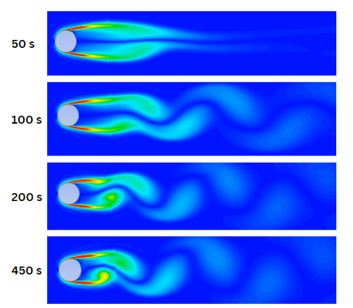
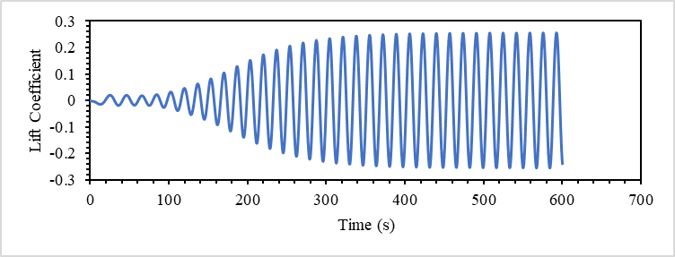
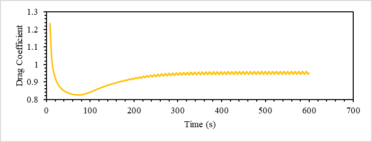
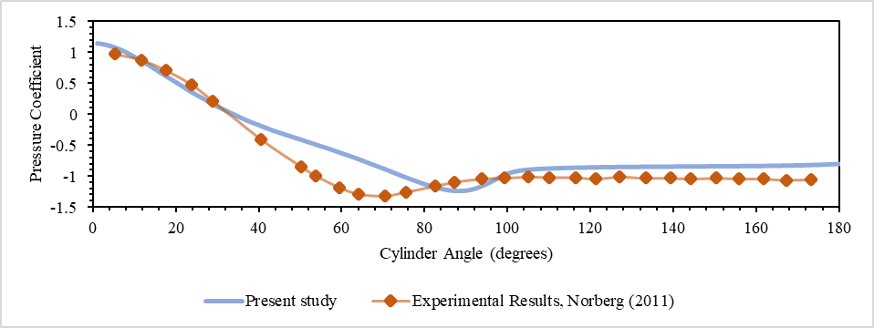

## Research question

Can an unsteady RANS model reproduce the development of alternating vortex shedding around an underwater circular cylinder at **Re ≈ 10,000**, and do its pressure, force, and frequency signatures agree with established cylinder-wake behaviour?

## From separation to unsteady loading

The cylinder creates an adverse pressure gradient that separates the boundary layers from its upper and lower surfaces. The detached shear layers become unstable, roll into alternating vortices, and form a von Kármán street. Each shed structure changes the pressure distribution and generates a fluctuating transverse force. If that shedding frequency approaches a structural natural frequency, the same mechanism can drive vortex-induced vibration.

`separation → shear layers → alternating shedding → fluctuating lift and drag → dominant frequency → VIV relevance`

## Numerical methodology

I simulated the transient wake using an **unsteady RANS formulation with the SST turbulence model**. The calculation followed startup, symmetry breaking, and the developed periodic regime. Validation used several independent observables: wake evolution, lift and drag histories, the surface-pressure distribution, and the dominant frequency extracted from the transient force signal.

## Wake development

<video controls muted loop playsinline width="100%">
  <source src="media/velocity-vortex-shedding.mp4" type="video/mp4">
</video>

The early wake remains nearly symmetric. Disturbances then grow, the shear layers roll up, and vortices detach alternately from the two sides. The developed wake establishes the physical basis for the periodic force response.

## Transient force response

The lift signal records the alternating wake directly. Its amplitude grows from small startup disturbances and then approaches a repeatable cycle. Drag approaches a developed mean with a smaller periodic component, consistent with the different symmetry of streamwise and transverse loading.

## Frequency-domain validation

The developed portion of the transient force signal was transformed to the frequency domain using an **FFT**. The dominant spectral peak identifies the shedding frequency, which can be expressed through the Strouhal relation

$$St = \frac{fD}{U_\infty}.$$

Comparing this frequency-based quantity with published circular-cylinder behaviour provides a stronger test than visual agreement between contours alone. The repository does not currently contain the sampled signal or final FFT figure, so this page does not invent a numerical peak or Strouhal value; adding that artifact would make the validation fully auditable.

## Surface-pressure validation

The pressure-coefficient comparison checks whether the surface loading that produces the force histories is physically plausible. The simulation reproduces the broad experimental trend while retaining discrepancies in the separated region, where RANS closure and near-wall treatment influence the result.

## Limitations and next questions

URANS models the influence of unresolved turbulent fluctuations and cannot resolve the full spectrum of wake turbulence. The study is also limited to a circular cylinder and does not couple the fluid loading to structural motion.

Natural extensions include non-circular and multiple bluff bodies, fluid-structure interaction, turbulence-resolving approaches, wake control, and direct investigation of vortex-induced vibration. These are future research directions, not completed parts of this study.
