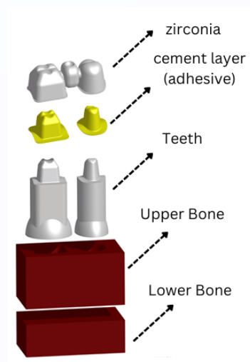
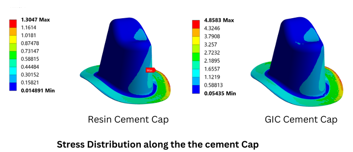

Investigated the influence of cement mechanical properties on the structural response of a three-unit zirconia fixed dental prosthesis (FDP) using finite element analysis. Evaluated how **cement layer thickness (CLT)** and **Young's modulus** affect stress distribution across prosthesis, cement layer, and supporting bone under physiological loading.

- Stress distribution across zirconia crown, cement layer, and bone interface under distributed loading.
- Strong sensitivity of stress concentrations to cement stiffness and thickness.
- Compared **resin vs. GIC cement** behavior for bonding and load transfer.
- Design insight for improving prosthesis durability and clinical survival rate.

