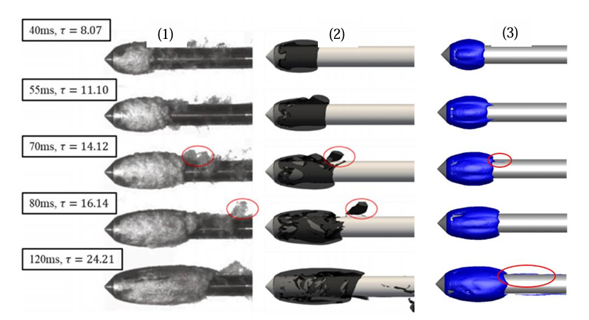
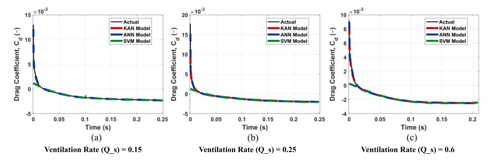

## Research problem

The paper asks how controlled ventilation changes cavity development and drag around underwater bodies, and whether transient CFD evidence can support an accelerated predictive model without disconnecting the prediction from the simulated physics.

## Method and principal finding

The study uses **transient RANS-VOF**, not DNS or LES, for disk- and cone-cavitator configurations and compares the numerical behaviour with external experimental and published numerical references. Across the investigated manuscript cases, the reported drag reduction is approximately **26% on average** and up to about **27%**. A Kolmogorov-Arnold Network is trained on CFD time-series for transient drag-coefficient prediction and compared with ANN and SVM baselines; the study reports KAN performance of **R² ≈ 0.99** for this prediction task.

## My contribution

My work included modelling ventilated-supercavitation cases, conducting transient multiphase CFD, and integrating the KAN surrogate with CFD time-series data. I do not attribute unlisted authorship roles to myself.

## Scope

The URANS closure does not resolve all turbulent scales, and the predictive model inherits the geometry, operating-range, and model-form bounds of its CFD dataset. Results outside those conditions require new physical evidence rather than automatic extrapolation.
