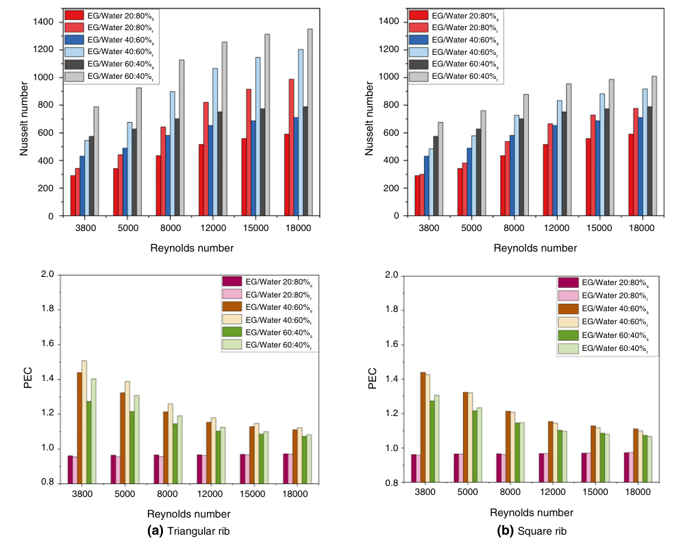
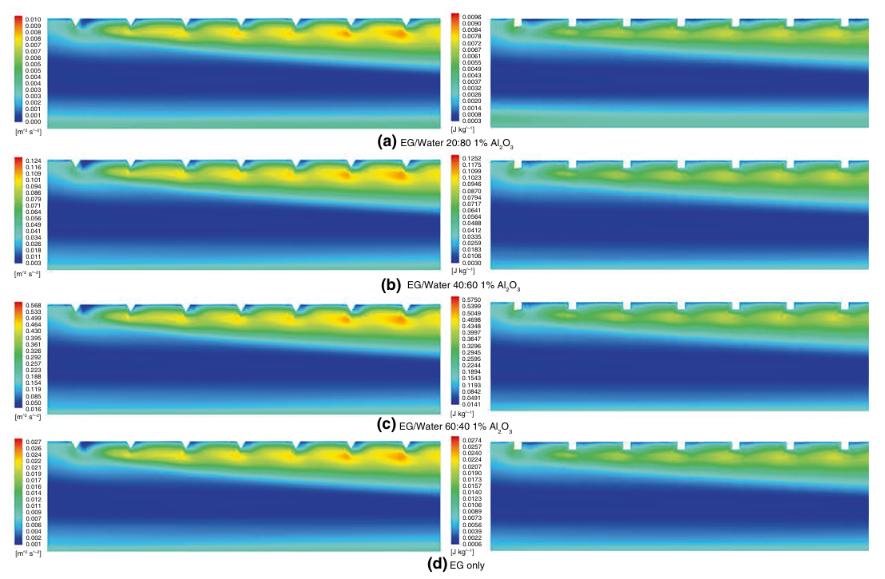

## What the paper investigates

The study uses a validated two-dimensional CFD model in ANSYS Fluent to examine how artificial rib geometry and Al2O3-ethylene glycol/water mixtures jointly affect turbulent heat transfer, pressure drop, and thermal-hydraulic performance in a solar heater over **Re = 3,000-18,000**.

## Principal findings reported by the study

The paper reports up to **71.6% heat-transfer enhancement** for triangular ribs and identifies the reported **40:60 EG/water** condition as the best thermal-hydraulic balance among the investigated cases, with a peak performance evaluation criterion of approximately **1.5**. The study reports comparison with reference data within approximately 8% error.

## My contribution

I **co-authored** this peer-reviewed research. The formal published contribution statement credits me with **manuscript writing and draft revision**. I therefore distinguish the paper's overall CFD methodology and results from my documented personal contribution; I do not claim to have developed the complete CFD model or conducted all numerical analysis.
